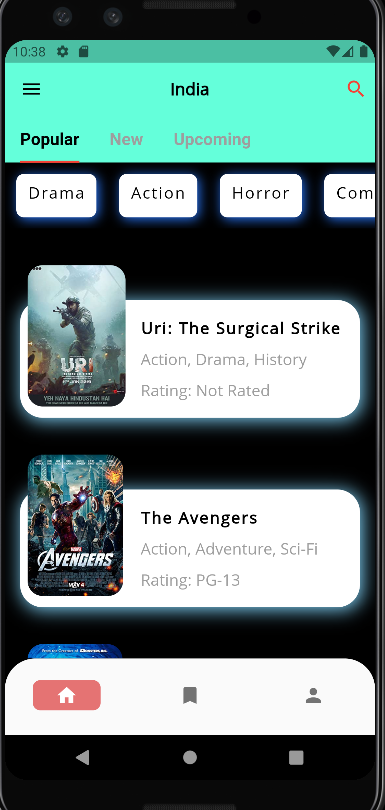

# movieWorld

movieWorld is a Cross Platform Application developed using Flutter. Information of particular movie is displayed from the OMDB API.

#### You can contribute, by solving the issue in Issues Tab. ✨
#### Feel free to raise any Issue, or problem you may face into the Issues Tab.

# **API Reference**
- [omdb api](https://www.omdbapi.com/)
- [API key](https://www.omdbapi.com/apikey.aspx)

# Libraries used

```yaml
  http: ^0.13.3
  google_fonts: ^2.1.0
```
# Screenshots

### Home Screen




# Installation
 
**Note:** Install the latest version of Flutter. You can download Flutter from [here.](https://docs.flutter.dev/get-started/install) 
 
* Fork this repository. Learn how to Fork [here.](https://docs.github.com/en/get-started/quickstart/fork-a-repo) 
* Clone the repository on your system by using `git clone https://github.com/chinmayilondhe/movieWorld.git`
* Run `flutter pub get` command.
* Run the application.

# [How to Contribute](https://docs.github.com/en/repositories/working-with-files/managing-files/adding-a-file-to-a-repository) ?

* After you have completed installation, add a new feature or solve the current issue.
* Add and commit your changes with an appropriate message.
* Push your changes. 
* Click Compare & pull request button and create a new pull request.
* Yayy! 🥳 You have successfully created a pull request. 
